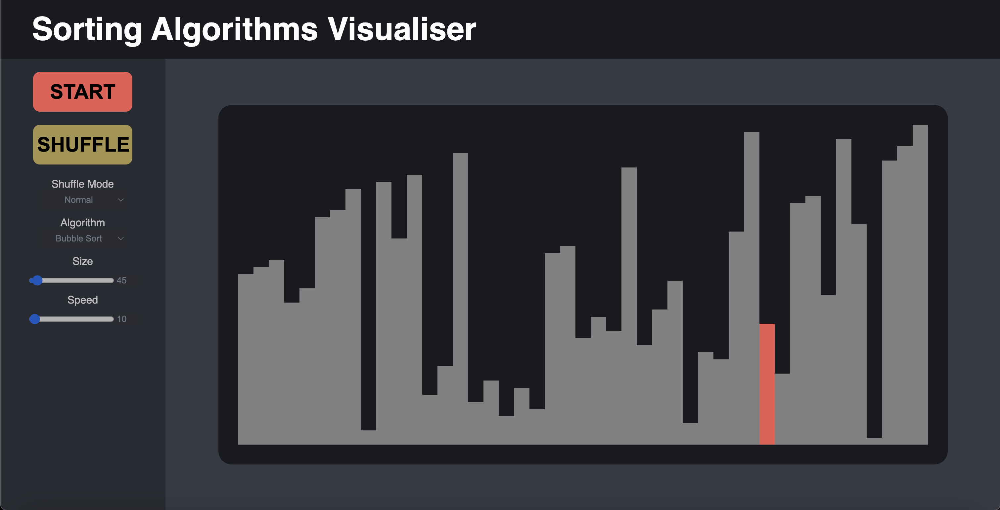
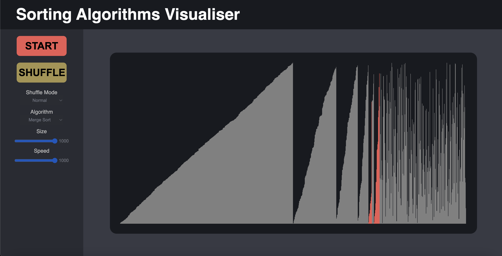
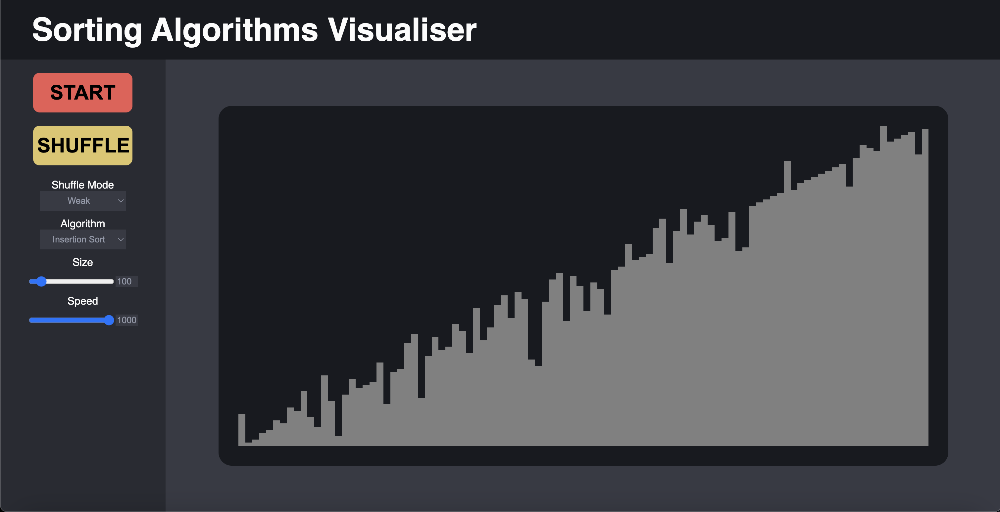
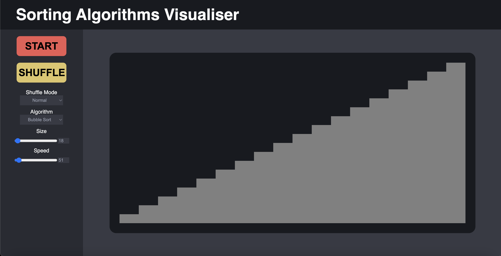

# Sorting Algorithm Visualiser

### Demo Link
[demo](https://laviyre.github.io/sorting-algorithm-visual/)

### About
This is a project to visualise sorting algorithms. Each operation on the array takes a fixed amount of time, helping the
user visualise both the algorithm as well as how fast the algorithm is under different conditions.

### Screenshots

An array in the middle of being sorted by bubble sort

A much larger array in the middle of being sorted by merge sort

An example of a weakly shuffled array being ready to be sorted by Insertion Sort, an algorithm which is typically slow for random data
but can be fast for nearly sorted data.

### Technologies
The project is a simple client side project that was built with React, Typescript and pure CSS.

### Setup
Visit the [demo](https://laviyre.github.io/sorting-algorithm-visual/) link.

Alternatively
- Download/Clone the repository
- run `npm install`
- run `npm start`
- Visit `localhost:3000`

### How to use

- Press the Start Button to run the sorting algorithm selected
- Press the Shuffle Button to shuffle the data presented
- The Shuffle Mode alters how the data is shuffled
    - A normal shuffle completely randomises the data with Fisher-Yates shuffle
    - A weak shuffle only moves each element to a nearby location
- The Algorithm determines which sorting algorithm is used
- Modify the size slider to change how many items are in the array
- Modify the speed slider to change how many operations are performed a second